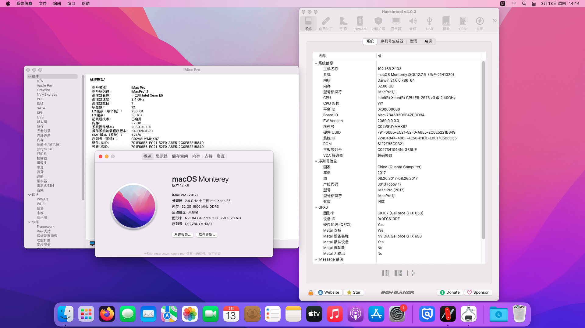

# JINGYUE-X99M-H-D3-Hackintosh
应用于精粤X99M-H D3(H81魔改)OpenCore 1.0.4的黑苹果引导 支持macOS Mojave-Sequoia

注意：
- 此EFI不含三码，实际使用时请自行使用[OCAT](https://github.com/ic005k/OCAuxiliaryTools)生成。
- 此EFI包含已开启自定义内存的配置文件(config-自定义内存.plist)，可根据自身实际需求使用和修改。


### 配置清单
|类型|型号|规格|
|---|---|---|
|CPU|Intel Xeon E5-2673 V3|2.4 GHz|
|内存|金士顿 16GB RECC DDR3×2|1600 MHz|
|SSD|昂达 A-24 SATA|256 GB|
|HDD|东芝 DT01ACA050(LENOVO)|500 GB|
|显卡|NVIDIA GeForce GTX 650|1024 MB|
|网卡|RealTek 8168|1000 Mbps|
|声卡|RealTek ALC897|立体声|
|操作系统|macOS Mojave - Sequoia|10.14 - 15.1|
|BIOS|American Megatrends UEFI|X99KR002(11/02/2022)|

#### 附注事项
- 以上配置清单给出的部分硬件(例如显卡)仅为本人临时测试使用，实际使用时建议更换其它可被macOS免驱的AMD独显。
- 此EFI引导理论可兼容High Sierra或以下版本的macOS，但未做进一步测试。
- 睡眠未测试，如果出现睡死问题，可使用终端强制关闭睡眠功能：
```
sudo pmset -a sleep 0
sudo pmset -a hibernatemode 0
sudo pmset -a disablesleep 1
```